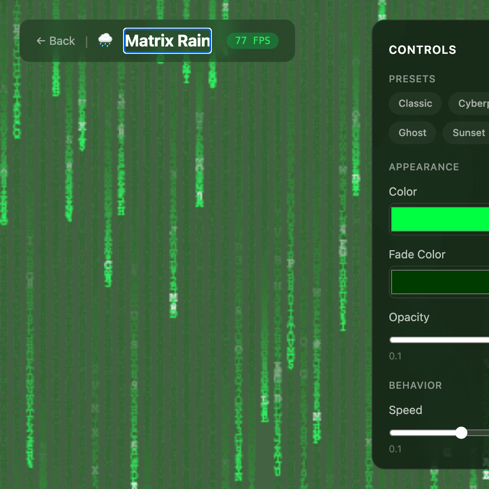
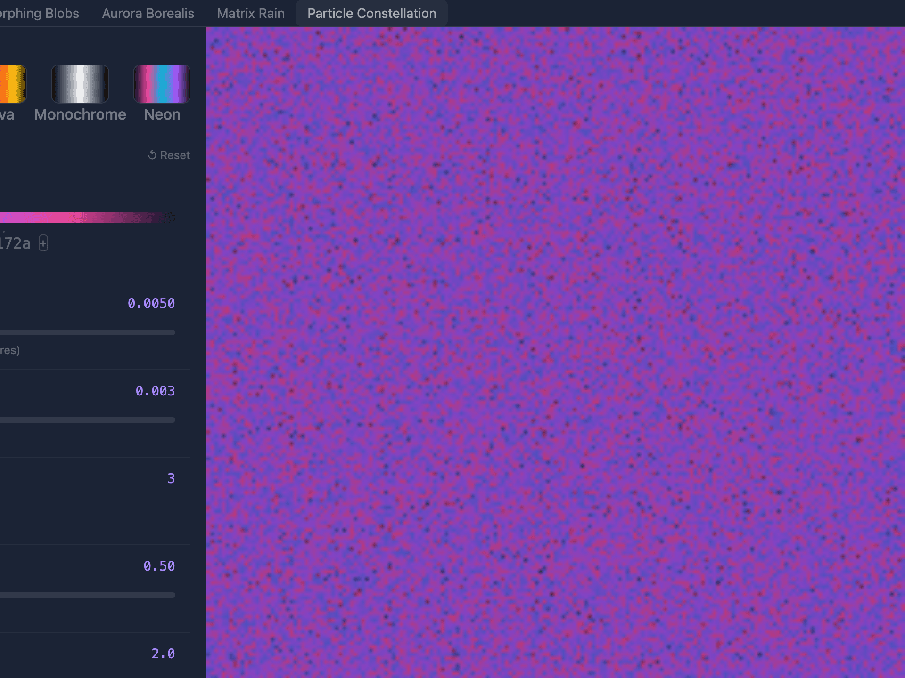
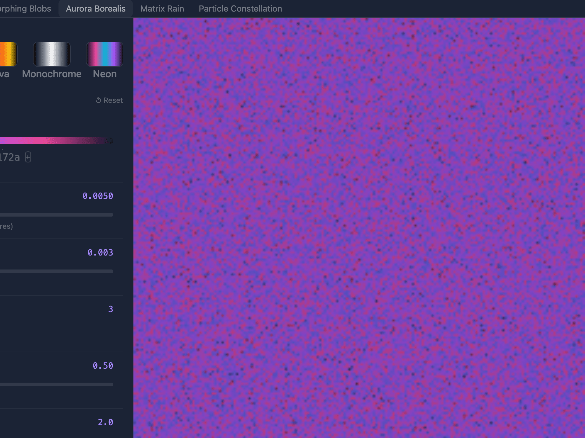
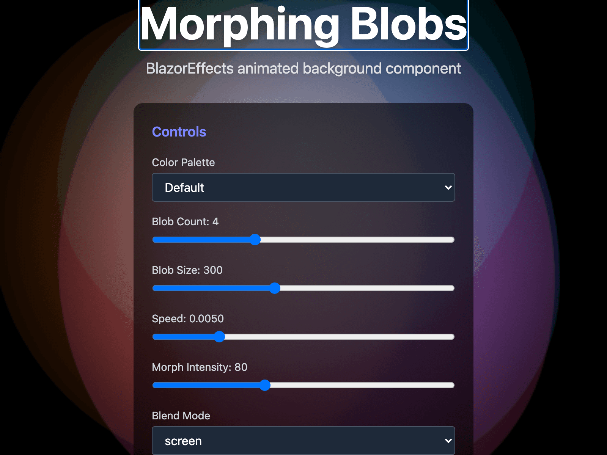
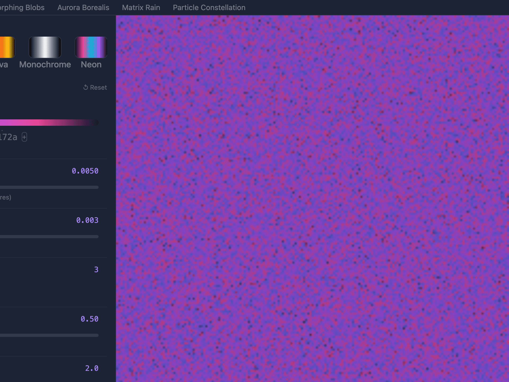

<div align="center">

# ✨ BlazorEffects

**Visually stunning animated background effects for Blazor**

Canvas-powered animations, particle systems, and generative art — packaged as drop-in Razor Class Libraries.

[](https://dotnet.microsoft.com/)
[](LICENSE)
[](build.sh)

[Getting Started](#getting-started) · [Effects](#effects) · [Playground](#playground) · [Architecture](#architecture) · [Contributing](CONTRIBUTING.md)

</div>

## Preview

<table>
  <tr>
    <td align="center"><b>🌧 Matrix Rain</b></td>
    <td align="center"><b>🌌 Particle Constellation</b></td>
    <td align="center"><b>🌈 Aurora Borealis</b></td>
  </tr>
  <tr>
    <td></td>
    <td></td>
    <td></td>
  </tr>
  <tr>
    <td align="center"><b>🫧 Morphing Blobs</b></td>
    <td align="center"><b>🌊 Noise Field</b></td>
    <td></td>
  </tr>
  <tr>
    <td></td>
    <td></td>
    <td></td>
  </tr>
</table>

> **Note:** These are real screenshots captured from the running BlazorEffects Playground. The actual effects are **smooth 60fps canvas animations** — run the Playground to see them in motion.

---

## Why BlazorEffects?

Most Blazor UI libraries give you buttons, cards, and forms. That's a solved problem.

**BlazorEffects gives your apps visual impact** — the kind of animated backgrounds that make people stop scrolling. Each effect is an independent NuGet package you install, configure, and drop into any Blazor layout or page.

### Design Principles

- **Motion-first** — Animations aren't afterthoughts, they're the product
- **Canvas-native** — HTML/CSS can't do what we do. We use `<canvas>` and WebGL for 60fps effects
- **Zero-config with full control** — Every effect works out of the box with sensible defaults, then exposes parameters for deep customization
- **Composable** — Effects nest inside any Blazor layout. Put your content over the top

---

## Effects

| Effect | Package | Description |
|--------|---------|-------------|
| 🌧 **Matrix Rain** | `BlazorEffects.MatrixRain` | Cascading character rain à la The Matrix |
| 🌌 **Particle Constellation** | `BlazorEffects.Particles` | Connected particle network with configurable density and color |
| 🌈 **Aurora Borealis** | `BlazorEffects.Aurora` | Flowing aurora curtains with multi-color palettes |
| 🫧 **Morphing Blobs** | `BlazorEffects.Blobs` | Organic gradient blobs with smooth morphing |
| 🌊 **Noise Field** | `BlazorEffects.Noise` | Animated simplex noise textures with flowing motion |

### Quick Look

```razor
<!-- Matrix Rain behind your content -->
<MatrixRain Color="#00ff41" Speed="1.2" Density="0.8">
    <h1>Welcome to the Matrix</h1>
</MatrixRain>

<!-- Particle constellation with a preset -->
<ParticleConstellation Config="ParticleConstellationPresets.DeepSpace">
    <MyPageContent />
</ParticleConstellation>

<!-- Aurora with custom palette -->
<AuroraBorealis Colors="@(["#00ff87", "#7b2ff7", "#00b4d8"])" />
```

---

## Getting Started

### Prerequisites

- .NET 8.0, 9.0, or 10.0
- Blazor Server or Blazor WebAssembly project

### Installation

Install only the effects you need:

```bash
# Individual effect packages
dotnet add package BlazorEffects.MatrixRain
dotnet add package BlazorEffects.Particles
dotnet add package BlazorEffects.Aurora
dotnet add package BlazorEffects.Blobs
dotnet add package BlazorEffects.Noise
```

### Usage

1. Add the component to any `.razor` file:

```razor
@page "/"
@using BlazorEffects.MatrixRain

<MatrixRain>
    <div class="my-content">
        <h1>My Blazor App</h1>
        <p>With a stunning animated background</p>
    </div>
</MatrixRain>
```

2. Customize with parameters:

```razor
<MatrixRain Characters="@MatrixRainPresets.Katakana"
            Color="#ff006e"
            Speed="1.5"
            FontSize="14"
            TargetFps="30"
            Height="100vh">
    <HeroSection />
</MatrixRain>
```

3. Use presets for instant professional looks:

```csharp
// Every effect ships with curated presets
var config = ParticleConstellationPresets.Cyberpunk;
var colors = AuroraBorealisPresets.Cosmic;
```

---

## Playground

The **BlazorEffects.Playground** package provides an interactive UI for exploring effects, tweaking parameters in real-time, and exporting ready-to-paste Razor code.

### Playground Features

- **Live preview** — See changes instantly on a full-size canvas
- **Visual preset browser** — Gradient thumbnails, not dropdowns
- **Parameter editor** — Sliders, color pickers, and text inputs
- **Code export** — Copy the exact `<Component>` markup for your project

```bash
dotnet add package BlazorEffects.Playground
```

---

## Architecture

```
BlazorEffects/
├── Core/                    # Shared abstractions
│   ├── EffectComponentBase  # Canvas lifecycle, JS interop, disposal
│   ├── IEffectDescriptor    # Playground integration contract
│   └── IJsEffectBridge      # JS module loading
│
├── MatrixRain/              # Per-effect Razor Class Libraries
├── Particles/               # Each package is independently deployable
├── Aurora/                  # Includes: Component + Config + Presets + JS
├── Blobs/
├── Noise/
│
└── Playground/              # Interactive parameter editor UI
```

### How It Works

Each effect follows the same pattern:

1. **Razor component** inherits `EffectComponentBase` — handles canvas lifecycle, JS module loading, and parameter diffing
2. **Config class** — typed parameters with sensible defaults
3. **JS module** — the actual animation (canvas API, requestAnimationFrame loop)
4. **Presets** — curated configurations for common looks
5. **Descriptor** — implements `IEffectDescriptor<TConfig>` for playground integration

The JS interop contract is minimal: `init(element, config) → id`, `update(id, config)`, `dispose(id)`.

### Design Decisions

| Decision | Rationale |
|----------|-----------|
| Razor Class Libraries per effect | Consumers install only what they need — no bloated mega-package |
| Canvas over CSS animations | Complex effects (particles, noise, matrix rain) need per-pixel control |
| `requestAnimationFrame` loops | Browser-native timing, automatic pause when tab is hidden |
| Config-hash diffing | Only re-sends config to JS when parameters actually change |
| Multi-targeting (net8/net9/net10) | Maximum compatibility across Blazor versions |

---

## Building from Source

```bash
# Clone
git clone https://github.com/cartsp/BlazorUI.git
cd BlazorUI

# Restore, build, test, format check — all in one
./build.sh

# Or step by step
dotnet build BlazorUI.slnx
dotnet test BlazorUI.slnx --verbosity normal
dotnet format BlazorUI.slnx --verify-no-changes
```

### Requirements

- .NET 10 SDK (builds for net8.0, net9.0, net10.0)
- Node.js (for Tailwind CSS in the demo app)

---

## Roadmap

- [ ] More effects (Gradient Waves, Starfield, Ripple, Vortex)
- [ ] WebGL-powered effects for GPU-intensive animations
- [ ] NuGet package publishing
- [ ] Interactive documentation site
- [ ] Effect compositor — layer multiple effects
- [ ] Scroll-reactive modes (effects respond to page scroll)

---

## Contributing

We'd love your help building stunning visual effects for Blazor. See [CONTRIBUTING.md](CONTRIBUTING.md) for guidelines on creating new effects, running tests, and submitting PRs.

---

## License

This project is licensed under the [MIT License](LICENSE).

---

<div align="center">

**Built with ✨ by [cartsp](https://github.com/cartsp)**

*BlazorEffects — because your Blazor apps deserve to look incredible.*

</div>
